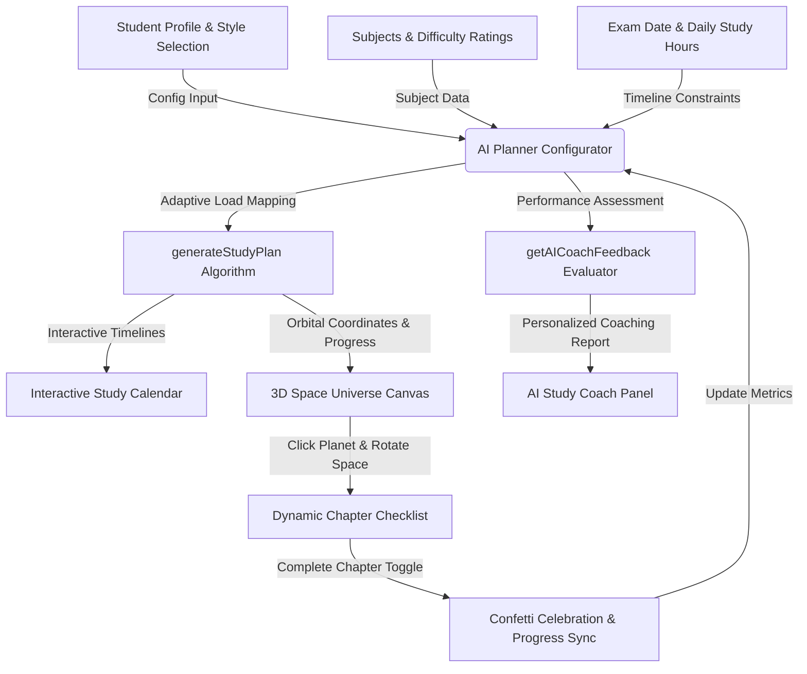

# 🌌 AuraPlanner — Next-Gen AI-Powered 3D Study Workspace

[](https://react.dev)
[](https://vite.dev)
[](https://threejs.org)
[](LICENSE)

**AuraPlanner** is a futuristic, immersive study orchestrator that converts your curriculum into an interactive 3D solar system. Powered by adaptive cognitive algorithms and an in-app AI study coach, AuraPlanner turns exam preparation into an interactive cosmic journey.

---

## 🌟 Interactive Features

### 1. 🪐 3D Study Universe (Three.js Orbit View)
*   **Space-Mapped Progress:** Each subject is rendered as a planet orbiting a central Sun (which represents your target Exam Date).
*   **Orbital Pacing:** Planets glow brighter as you complete chapters (Red $\rightarrow$ Gold $\rightarrow$ Green).
*   **Immersive Navigation:** Click on planets to focus on that subject, drag to rotate the starfield space, and scroll to zoom in/out of your curriculum cosmos.
*   **Central Sun Pulse:** The core Sun pulses faster and changes color (Cyan $\rightarrow$ Red) as the exam date approaches, giving a visual cue of urgency.

### 2. 🧠 Adaptive Cognitive Scheduling
*   **Difficulty Weighting:** Hard, Medium, and Easy subjects receive custom cognitive load weights to balance study sessions.
*   **Study Style Personalization:** Choose between **Visual/Maps**, **Practice Qs**, or **Read/Summarize** styles to customize specific action prompts in your daily agenda.
*   **Rest Days Integration:** Custom selection of weekly rest days ensures mental recharge is planned to avoid cognitive fatigue.
*   **Revision Phase Safeguard:** Allocates the final 15% of the timeframe exclusively to revision and mock test drills.

### 3. 🤖 In-App AI Study Coach
*   **Dynamic Status Evaluation:** Constantly evaluates preparation pacing (e.g., *On Track*, *Lagging Behind*, *Critical Risk*, *Final Revision*).
*   **Pacing Alerts:** Generates personalized reports based on daily chapter requirements and completed rate.
*   **Priority Action Steps:** Computes immediate steps to boost performance and advice tailored to your learning style.

---

## 🗺️ System Architecture & Data Flow



---

## 🛠️ Tech Stack & Libraries
*   **Core Framework:** [React 19](https://react.dev/) + [Vite 8](https://vite.dev/)
*   **3D Graphics:** [Three.js](https://threejs.org/) (Custom WebGL space simulation)
*   **Icons:** [Lucide React](https://lucide.dev/)
*   **Micro-interactions:** [Canvas Confetti](https://github.com/catdad/canvas-confetti)
*   **Styling:** Custom Glassmorphism CSS featuring HSL curated glow systems

---

## 🚀 Quick Start & Installation

Ensure you have [Node.js](https://nodejs.org/) installed, then follow these steps:

### 1. Clone the repository
```bash
git clone https://github.com/SPradhan-code/AI-StudyPlanner.git
cd AI-StudyPlanner
```

### 2. Install dependencies
```bash
npm install
```

### 3. Start the local development server
```bash
npm run dev
```

### 4. Build for production
```bash
npm run build
npm run preview
```

---

## 🎨 Interactive Preview & Usage Guide

<details>
<summary><b>📖 How to Use AuraPlanner (Click to Expand)</b></summary>

1. **Configure Your Profile:** Input your name and preferred study style (Visual, Practice, or Reading).
2. **Define the Subject Matrix:** Add subjects, set difficulty tiers, and specify the number of chapters. (Standard subjects like Physics/Math auto-populate with core academic topics).
3. **Set Timeline Parameters:** Choose your exam date, daily hour target, and select your mental health rest days.
4. **Enter the 3D Workspace:**
   * **Drag** to rotate the universe camera.
   * **Scroll** to zoom.
   * **Click** a planet to focus the Subject Checklist.
   * **Check off** completed chapters to trigger a confetti celebration and watch your planet glow green!
</details>

---

## 📄 License
This project is licensed under the MIT License.

---

Created with 🌌 and 🧠 for students reaching for the stars.
