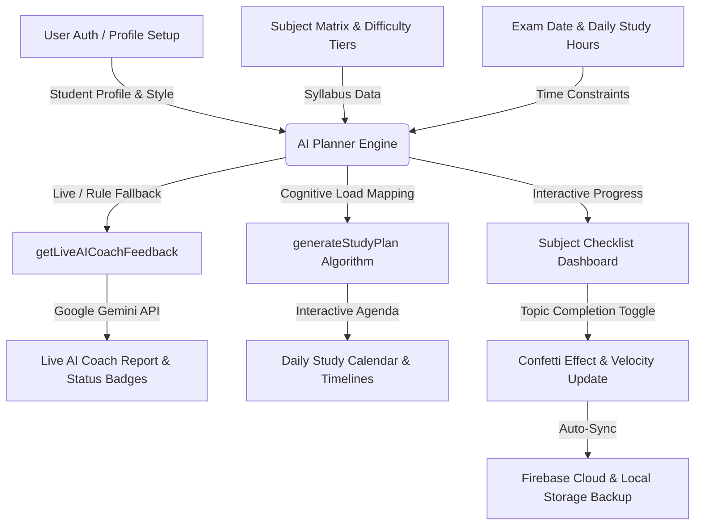

# 🌌 AI Study Planner — AI-Powered Intelligent Study Workspace

[](https://react.dev)
[](https://vite.dev)
[](https://ai.google.dev/)
[](https://firebase.google.com/)
[](LICENSE)

**AI Study Planner** is a smart, interactive study orchestrator that structures your curriculum, builds personalized daily schedules, and tracks your exam preparation pacing. Powered by adaptive cognitive algorithms and an in-app **Live Gemini AI Study Coach**, it turns exam preparation into an organized and engaging experience.

---

## 🌟 Key Features

### 1. 🧠 Adaptive Cognitive Scheduling & Daily Calendar
*   **Difficulty Weighting:** Assign custom cognitive load weights (Hard: 1.8x, Medium: 1.3x, Easy: 1.0x) to balance daily study hours across subjects.
*   **Learning Style Personalization:** Custom action prompts tailored for **Visual/Maps**, **Practice Qs**, or **Read/Summarize** learning preferences.
*   **Rest Day Protection:** Define weekly rest/off days to prevent burnout — the algorithm rebalances study tasks around your break days.
*   **Revision Phase Lock:** Automatically reserves the final 15% of your available timeline exclusively for full syllabus revisions and mock tests.

### 2. 🤖 Live Gemini AI Study Coach
*   **Real-time Intelligent Guidance:** Integrated with Google Gemini API (`VITE_GEMINI_API_KEY`) to analyze completion pacing, calculate required daily velocity, and generate actionable feedback.
*   **Dynamic Preparation Badges:** Instantly categorizes status into *On Track*, *Lagging Behind*, *Critical Risk*, or *Final Revision*.
*   **Smart Fallback:** Seamlessly switches to a local rule-based cognitive engine if no API key is set.

### 3. 📚 Interactive Subject & Topic Checklist
*   **Dynamic Topic Tracker:** Easily select subjects, mark topics as completed, and track progress percentages in real-time.
*   **Confetti Micro-Interactions:** Celebratory particle effects upon completing topics to boost study motivation.
*   **Custom Subject Setup:** Supports both pre-populated topics for core academic subjects and fully customizable subject/chapter lists.

### 4. 🔒 Firebase Cloud Data Sync & Authentication
*   **Secure User Accounts:** Email/Password registration and login via Firebase Authentication.
*   **Cloud Progress Sync:** Automatically saves and syncs student profiles, schedule settings, and completed topics to Firestore.
*   **Offline Resilience:** Includes local storage backup fallbacks to ensure uninterrupted access even when offline.

---

## 🗺️ System Architecture & Data Flow



---

## 🛠️ Tech Stack & Dependencies

*   **Frontend Framework:** [React 19](https://react.dev/)
*   **Build Tool & Dev Server:** [Vite 8](https://vite.dev/)
*   **AI Service:** [Google Gemini API](https://ai.google.dev/)
*   **Cloud Database & Auth:** [Firebase Auth & Firestore](https://firebase.google.com/)
*   **Iconography:** [Lucide React](https://lucide.dev/)
*   **Effects:** [Canvas Confetti](https://github.com/catdad/canvas-confetti)
*   **Styling:** Custom Glassmorphism CSS featuring curated HSL dark mode tokens

---

## 🚀 Quick Start & Installation

### Prerequisites
*   [Node.js](https://nodejs.org/) (v18 or higher recommended)
*   `npm` or `yarn`

### 1. Clone the repository
```bash
git clone https://github.com/SPradhan-code/AI-StudyPlanner.git
cd AI-StudyPlanner
```

### 2. Install dependencies
```bash
npm install
```

### 3. Environment Setup
Create a `.env` file in the root directory:
```env
# Optional: Google Gemini API Key for Live AI Coach Feedback
VITE_GEMINI_API_KEY=your_gemini_api_key_here

# Firebase Configuration
VITE_FIREBASE_API_KEY=your_firebase_api_key
VITE_FIREBASE_AUTH_DOMAIN=your_project.firebaseapp.com
VITE_FIREBASE_PROJECT_ID=your_project_id
VITE_FIREBASE_STORAGE_BUCKET=your_project.appspot.com
VITE_FIREBASE_MESSAGING_SENDER_ID=your_messaging_sender_id
VITE_FIREBASE_APP_ID=your_app_id
```

### 4. Start the development server
```bash
npm run dev
```

### 5. Build for production
```bash
npm run build
npm run preview
```

---

## 📖 Usage Guide

1. **Sign Up / Log In:** Create an account or sign in to save your study progress to the cloud.
2. **Configure Profile & Learning Style:** Input your name and choose your preferred study style (Visual, Practice, or Reading).
3. **Build Subject Matrix:** Add subjects, select difficulty ratings (Hard, Medium, Easy), and define chapter/topic lists.
4. **Set Schedule Parameters:** Pick your target exam date, target daily study hours, and weekly rest days.
5. **Track Daily Progress:**
   * **Dashboard:** Check off completed topics, view subject completion rates, and trigger progress celebrations.
   * **Calendar View:** Review day-by-day study task blocks tailored to your study style.
   * **AI Coach Panel:** Consult live advice and prep status warnings generated by Google Gemini.

---

## 📄 License

This project is licensed under the [MIT License](LICENSE).

---

<p align="center">
  Made with 🧠 for students reaching for academic excellence.
</p>
