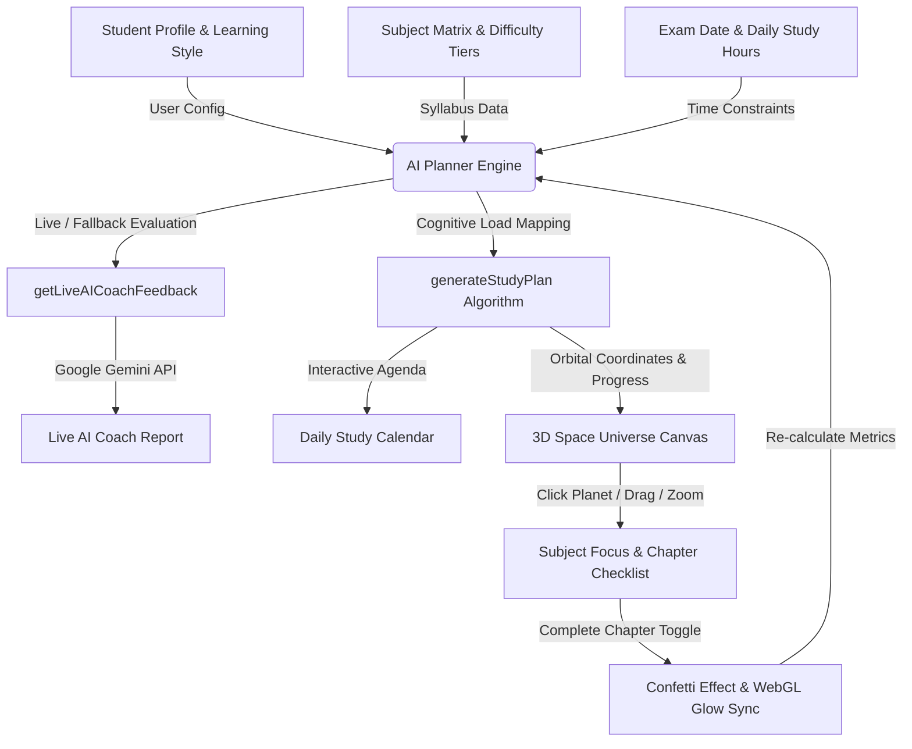

# 🌌 AI Study Planner — Next-Gen AI-Powered 3D Study Workspace

[](https://react.dev)
[](https://vite.dev)
[](https://threejs.org)
[](https://ai.google.dev/)
[](LICENSE)

**AI Study Planner** is a futuristic, immersive study orchestrator that converts your curriculum into an interactive 3D solar system. Powered by adaptive cognitive algorithms and an in-app **Live Gemini AI Study Coach**, AI Study Planner turns exam preparation into an engaging cosmic journey.

---

## 🌟 Key Features

### 1. 🪐 3D Study Universe (Three.js WebGL Orbit View)
*   **Space-Mapped Progress:** Each subject is rendered as a unique planet orbiting a central Sun (which represents your target Exam Date).
*   **Orbital Pacing:** Planets dynamically glow brighter as you complete chapters (Red $\rightarrow$ Gold $\rightarrow$ Emerald).
*   **Immersive Controls:** Drag to rotate space, scroll to zoom, and click any planet to highlight its specific subject checklist.
*   **Optimized WebGL Rendering:** High-performance render loop using Ref-decoupled callbacks to maintain 60 FPS without scene teardowns.
*   **Central Sun Pulse:** The core Sun pulses faster and shifts hue (Cyan $\rightarrow$ Red) as the exam date draws nearer.

### 2. 🧠 Adaptive Cognitive Scheduling
*   **Difficulty Weighting:** Assign custom cognitive load weights (Hard: 1.8x, Medium: 1.3x, Easy: 1.0x) to balance daily workloads.
*   **Learning Style Personalization:** Tailored activity verbs and prompts for **Visual/Maps**, **Practice Qs**, or **Read/Summarize** learning styles.
*   **Rest Day Safeguard:** Specify weekly rest days so your algorithm automatically rebalances workloads while respecting mental health recharges.
*   **Revision Phase Lock:** Reserves the final 15% of your remaining timeline exclusively for mock exams and full syllabus reviews.

### 3. 🤖 Live Gemini AI Study Coach
*   **Real-time Intelligent Feedback:** Uses the Google Gemini API to analyze study progress, calculate daily velocity, and generate actionable coaching advice.
*   **Dynamic Status Badges:** Automatically categorizes prep status into *On Track*, *Lagging Behind*, *Critical Risk*, or *Final Revision*.
*   **Graceful Fallback:** Seamlessly switches to a local rule-based cognitive engine if no API key is provided.

### 4. 🎉 Micro-Interactions & Gamification
*   **Celebration Effects:** Triggers celebratory particle confetti whenever chapters are completed.
*   **Live Metrics:** Instant updates for total topics, completion rates, remaining days, and daily target hours.

---

## 🗺️ System Architecture & Data Flow



---

## 🛠️ Tech Stack & Dependencies

*   **Frontend Framework:** [React 19](https://react.dev/)
*   **Build Tool & Dev Server:** [Vite 8](https://vite.dev/)
*   **3D Graphics Engine:** [Three.js](https://threejs.org/)
*   **AI Service:** [Google Gemini API](https://ai.google.dev/)
*   **Iconography:** [Lucide React](https://lucide.dev/)
*   **Effects:** [Canvas Confetti](https://github.com/catdad/canvas-confetti)
*   **Styling:** Custom Glassmorphism CSS featuring HSL glow design tokens

---

## 🚀 Quick Start & Installation

### Prerequisites
*   [Node.js](https://nodejs.org/) (v18 or higher recommended)
*   `npm` or `yarn`

### 1. Clone the repository
```bash
git clone https://github.com/SPradhan-code/AI-StudyPlanner.git
cd AI-StudyPlanner
```

### 2. Install dependencies
```bash
npm install
```

### 3. Environment Setup (Optional for Live AI Coach)
Create a `.env` file in the root directory:
```env
VITE_GEMINI_API_KEY=your_gemini_api_key_here
```
*(Note: If omitted, the app will automatically use the built-in rule-based AI Coach fallback.)*

### 4. Start the development server
```bash
npm run dev
```

### 5. Build for production
```bash
npm run build
npm run preview
```

---

## 📖 Usage Guide

1. **Configure Student Profile:** Enter your name and select your preferred study style (Visual, Practice, or Reading).
2. **Setup Subject Matrix:** Add your subjects, pick difficulty levels, and enter total chapters (or use default topics for common subjects).
3. **Set Exam & Time Bounds:** Select your exam target date, daily available study hours, and weekly off/rest days.
4. **Explore the 3D Workspace:**
   * **Rotate/Pan:** Click and drag anywhere in the space background.
   * **Zoom:** Scroll up/down to zoom in on planets or view the whole orbit system.
   * **Focus Subject:** Click on any orbiting planet to view its chapters.
   * **Check off Chapters:** Completing chapters triggers particle celebrations and updates your planet's glow level in real-time.
5. **Consult AI Coach:** Check the right panel for live advice, prep status warnings, and custom action points from your AI Coach.

---

## 📄 License

This project is licensed under the [MIT License](LICENSE).

---

<p align="center">
  Made with 🌌 and 🧠 for students reaching for the stars.
</p>
